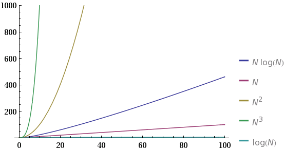

#01.最大子序列和

 **问题：** 给定（可能有负数的）正数A1，A2，A3，...，An，求它的连续子序列的最大和。
 
 这个问题在学习算法的时候经常会被引用到，因为解决它的算法有很多种，并而这些算法的性能差异又很大。
 最坏时间复杂度分别有 **O(N^3)** , **O(N^2)** , **O(NlogN)** , **O(Nlog)** 。它们的性能对比如下：
 
 
 
 
